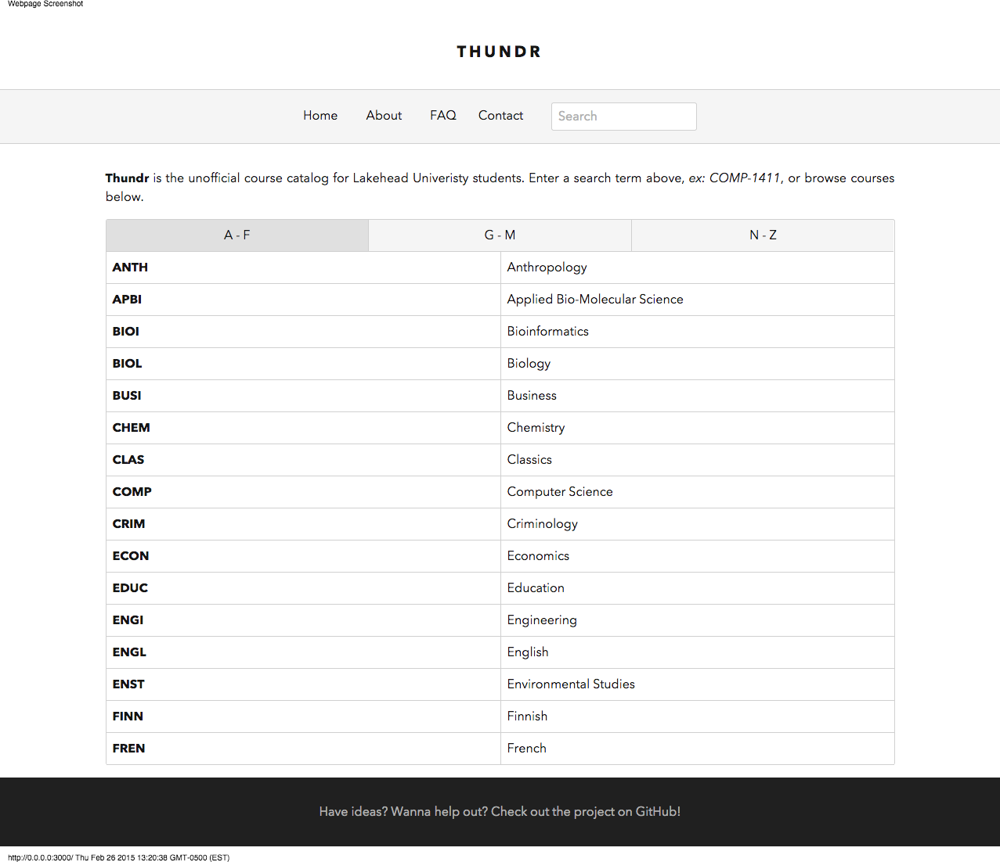
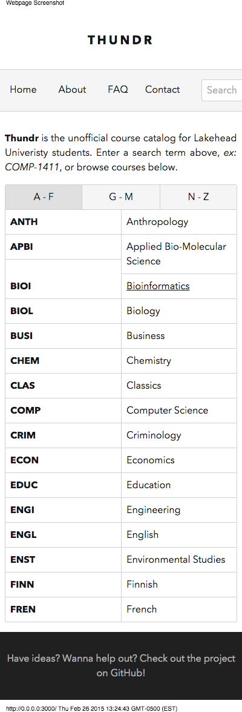
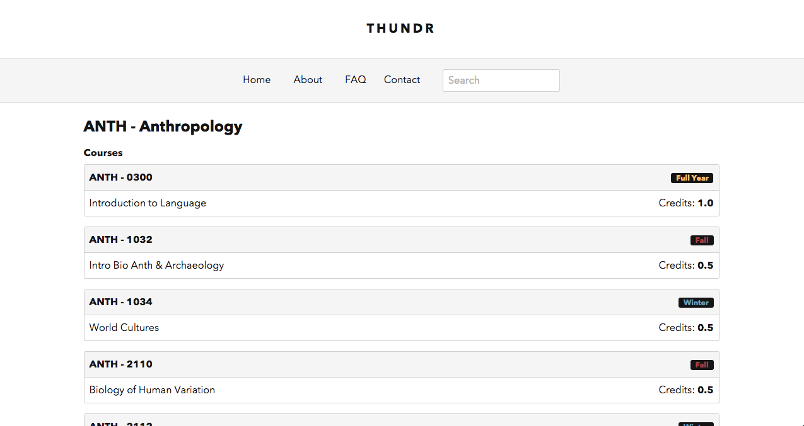
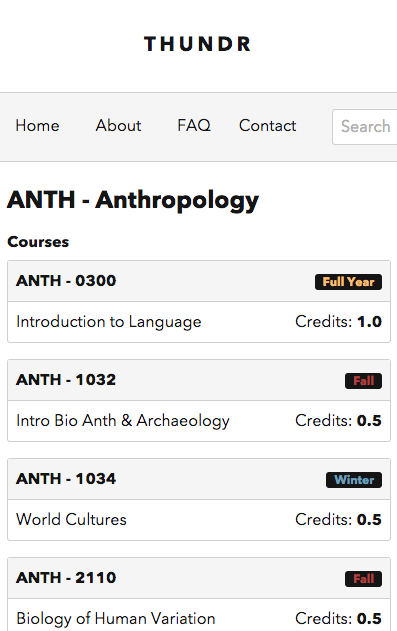
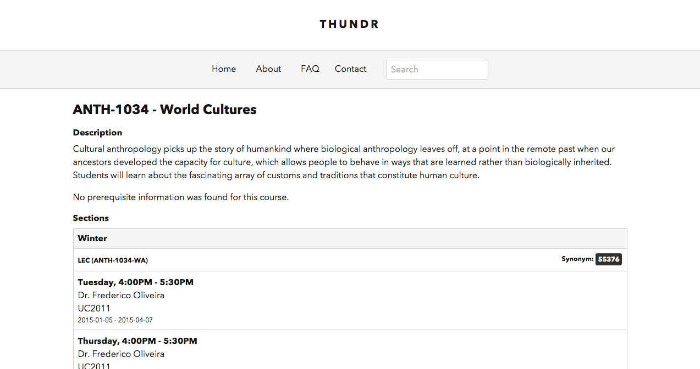
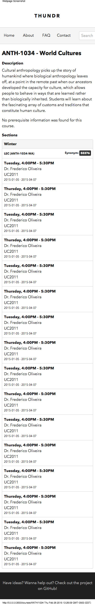
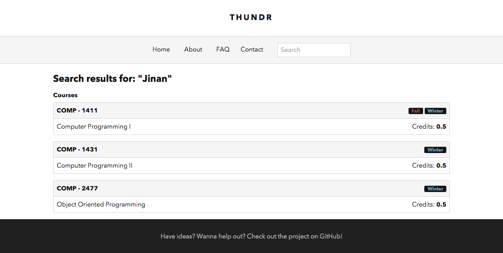
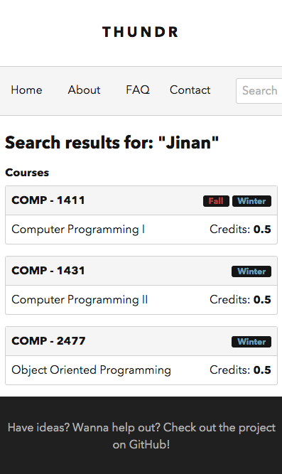

##Thundr 2.0 (A proposal)

Every few months I've been telling myself I'm going to create a different design and layout for [thundr](http://thundr.ca). After 2 years of telling myself that I finally did. Check the screenshots for the new designs, or run the app yourself (either clone this repo or clone the `minimal` branch in [my fork of Thundr](https://github.com/bentranter/thundr/tree/minimal)).

####My changes

- Completely new layout
- Added a label for full-year courses
- Setup click-to-copy for course synonyms

####Screenshots

Home - Desktop:

Home - Mobile:

*Note: The nav scrolls horizontally, so the search section isn't actually cut off)

Course List - Desktop:

Course List - Mobile:

Course Description - Desktop:

Course Description - Mobile:

Search Results - Desktop:

Search Results - Mobile:

